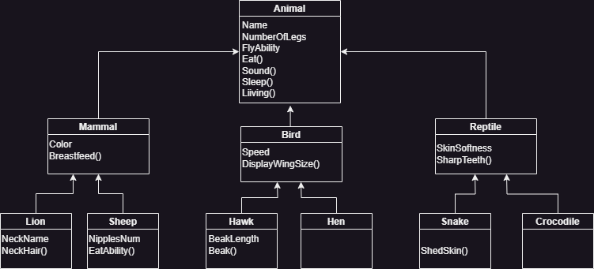

# introduction 
In this application, we have implemented a 3-layer inheritance for the zoo. This design allows for the inclusion of various types of animals with their distinct behaviors and properties. We have defined common behaviors for all animals in the application, while also creating unique behaviors for each specific animal. This approach enables us to represent a diverse range of animal families within the zoo. For instance, the lion family consists of multiple individuals, each with its own set of properties.

# UML drawing

# OOP principles
Inheritance allows us to share methods and properties between classes. For example, the class "Mammals" inherits from the class "Animal," and the class "Lion" inherits from "Mammals."

Abstraction allows us to define methods or properties in a base class without providing a specific implementation. We can then provide a definition for those methods or properties in individual classes where we want to use them.

To achieve encapsulation, we can make properties or methods private to a class, preventing other instances from accessing or using them.

Polymorphism is similar to abstraction, but instead of just providing a definition, we can override an existing method with our own code. This allows us to reuse methods that already have a definition in the base class. For example, the "Mammal" class has a virtual method "Breastfeed()" which can be overridden in subclasses like "Lion" and "Sheep".
